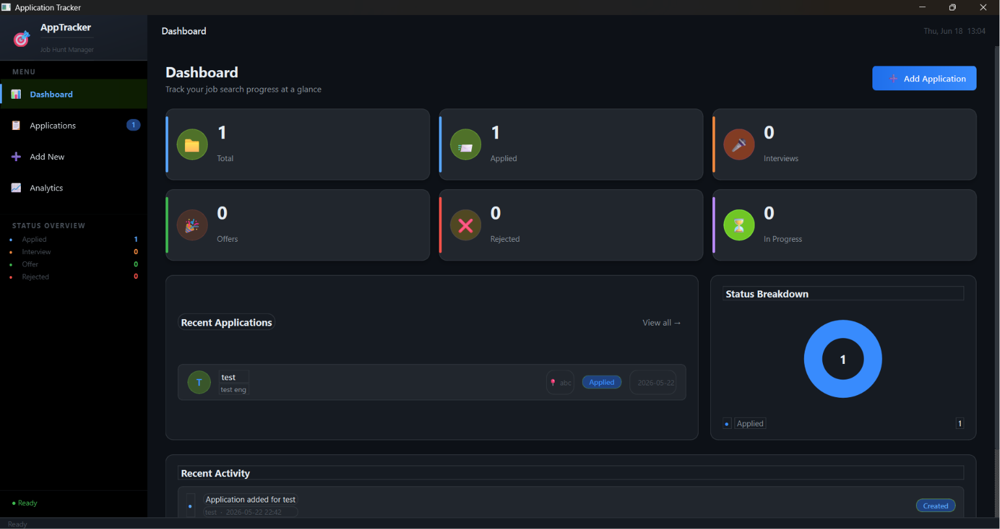
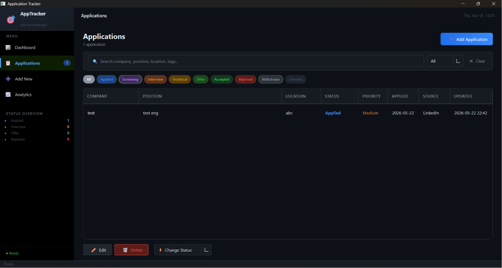
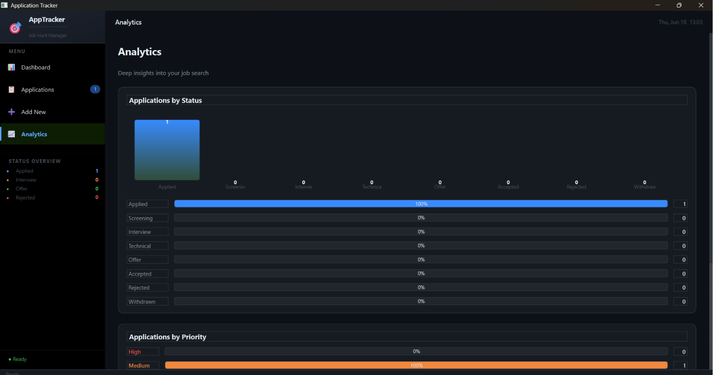

# 📋 Job Application Tracker

A modern desktop application built with Python for organizing and tracking job applications throughout the hiring process.

The application helps job seekers manage opportunities, monitor interview progress, track deadlines, store important information, and gain insights through built-in analytics.

---

## 🚀 Features

### 📊 Dashboard
- Overview of total applications
- Applied, Interview, Offer, Rejected, and In Progress statistics
- Recent applications section
- Status breakdown visualization
- Activity tracking

### 📝 Application Management
- Add new applications
- Edit existing applications
- Delete applications
- Search and filter records
- Manage job opportunities efficiently

### 🔄 Application Status Tracking

Track applications across multiple hiring stages:

- Applied
- Screening
- Interview
- Technical Round
- Offer
- Accepted
- Rejected
- Withdrawn
- Ghosted

### 📈 Analytics
- Application status distribution
- Priority-based insights
- Progress visualization
- Interactive charts and summaries

### 📌 Additional Features
- Company and job details management
- Job URL storage
- Salary range tracking
- Follow-up reminders
- Deadlines management
- Notes and attachments
- Contact information storage
- Custom tags and categorization

---

## 🛠️ Tech Stack

- Python
- SQLite
- Tkinter / CustomTkinter
- Object-Oriented Programming (OOP)

---

## 📂 Project Structure

```text
application-tracker/
│
├── ui/
├── screenshots/
├── data/
├── database.py
├── models.py
├── main.py
├── requirements.txt
└── README.md
```

---

## ⚙️ Installation

```bash
git clone https://github.com/shahilmbrk/Job-Application-Tracker.git

cd Job-Application-Tracker

pip install -r requirements.txt

python main.py
```

---

## 📸 Screenshots

### Dashboard

Track overall job search progress with application statistics, recent activity, and status breakdown charts.



---

### Applications

View, search, filter, edit, and manage all job applications from a centralized table.



---

### Analytics

Analyze application status distribution and priorities through visual reports.



---

### Add New Application

Store complete application details including company, position, contacts, deadlines, notes, and attachments.


---

## 🎯 Future Improvements

- Email notifications
- Calendar integration
- CSV / Excel export
- Docker support
- Cloud synchronization
- User authentication
- Multi-user support
- GitHub Actions CI/CD
- AWS deployment
- Reminder notifications

---

## 💡 Why This Project?

Job hunting often involves managing dozens of applications across different platforms. This application provides a centralized workspace to organize opportunities, track progress, manage deadlines, and stay focused during the job search process.

---

## 👨‍💻 Author

**Shahil Mubarak**

Computer Science Engineering Graduate  
Python Developer | Aspiring DevOps Engineer

- GitHub: https://github.com/shahilmbrk
- LinkedIn: https://linkedin.com/in/shahilmubarak

---

## ⭐ Support

If you found this project useful, consider giving it a star on GitHub.